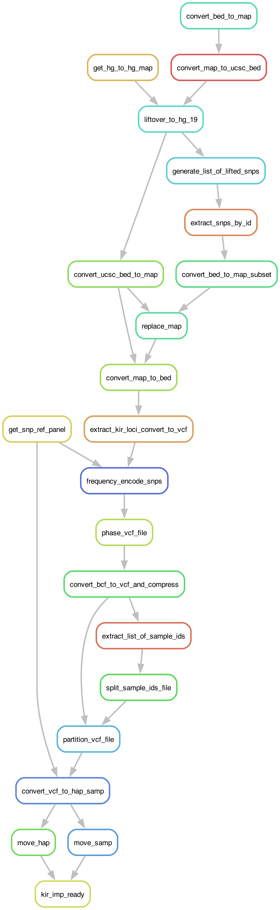

# KIR_IMP_READY
## _A Snakemake Pipeline to Prepare SNP Microarray data for use with [KIR*IMP](https://imp.science.unimelb.edu.au/kir/)_

## Authors
* Christopher Michael Brooks ([@chrismbrooks](https://github.com/chrismbrooks))

# Workflow Overview



# Table of Contents
1. [Setup](#setup)
2. [Input](#inputs)
3. [Run](#run)
3. [Output](#output)

# Setup
To download and configure the pipeline, run the following command:

```sh
    git clone https://github.com/ChrisMBrooks/KIR_IMP_READY.git
    cd KIR_IMP_READY
```

TBD, TBD, TBD

```json
"TBD"
```

Finally, create a conda environment using the provided ``Envs/snakemake_env.yml`` environment file: 

```sh
conda create -f Envs/snakemake_env.yml
```

# Input
Two main input files must be configured or be made available before the pipeline can be run: 
* ``pipeline.config.json`` configuration files
* ``.bed / .bim / .fam`` SNP geneotype files

## Pipeline Config JSON

The ``pipeline.config.json`` file is a simple high level JSON file containing configuration settings and metadata. The following key-item pairs are required: 

* ``project`` is an input string, and represents the project name to be used by snakemake, e.g. ``KIR_IMP_READY_TEST``. 

* ``bed_bim_fam_filename`` is the filepath location to the ``.bed / .bim / .fam`` files. All files must have the same filename. The text in the JSON attribute should include the directory path and the filename, but not the file extension. 

* ``bed_bim_fam_hg_build`` is the reference genome used when constructing the ``.bed / .bim / .fam`` files. The following builds are supported: hg38, hg16, hg17, hg18 & hg19. KIR*IMP requires hg19 so all files will be lifted over to this reference genome.   

* ``num_data_partitions`` is the number of files to segment the KIR\*IMP input file into. KIR\*IMP Required Oxford HAPS/SAMPLE files of less than 100MB, so it is likely necessary to partition the data into two or more input files. 

# Run
TBD, TBD, TBD

## Part Ia

Activate the snakemake conda environment, ``snakemake_env`` and then run the following command:  

```sh
snakemake --cores 8 --use-conda --conda-frontend conda --keep-going
```


# Output

The phased Hap/Samp files for each of N partitions are output into the ``Output/Liechti2023/KIR_IMP_READY``, e.g.:

* TBD
* TBD

# Afterward

To obtain imputation results, individually upload each of the Hap/Sam pairs to the [KIR*IMP Jobs Page](https://imp.science.unimelb.edu.au/kir/jobs). You will need to register and create an account. Upon completion of the KIR imputation you will receive a confirmation email and ``acces key``. Results can be downloaded from the same Jobs Page. 
